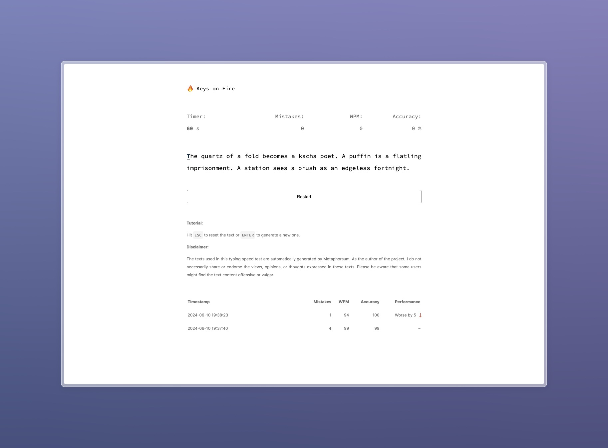

# Summary

🔥 Keys on Fire is a small typing speed test/game developed for Turing College as a first, larger scale JavaScript project.

The test allows you to test your typing skills and calculates your mistakes, accuracy, WPM (Words Per Minute) count and your performance rating. All of the results are saved in a data table at the bottom of the page.

# Key takeaways

This section outlines the ups and downs I've encountered while doing this task.

- The ups:
    - I am extremely happy how this project turned out and I had a lot of fun seeing it evolve over time;
    - The project has quite a few breakpoints that allow it to work on multiple screen sizes, as well as on mobile screens;
    - Even though I still find JavaScript to be difficult, this project allowed me to break the ice and feel more comfortable with it.
- The downs:
   - I had to follow an amplitude of JS tutorials in the very beginning and felt slightly de-motivated because of it;
   - I still find module exports / imports to be confusing.

# Prerequisites

Use the Live Server plugin to fire up this project and test it out.

# How to use

Your evaluation will begin as soon as you start typing. You can see the remaining time and other relevant stats at the top of the page.

Special keys:
- In order to re-try the same text, hit `ESC` while typing;
- Hit `Enter` to fetch a new text paragraph.

As soon as you finish typing the text or the timer runs out, the input field will be disabled and you will not be able to type anymore.

The results in the data table are loaded from and saved to the local storage.

# Disclaimer

The texts used in this typing speed test are automatically generated by [Metaphorsum](http://metaphorpsum.com/). As the author of the project, I do not necessarily share or endorse the views, opinions, or thoughts expressed in these texts. Please be aware that some users might find the text content offensive or vulgar.
